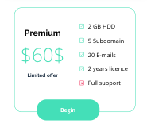

Best Shop website

Responsive web design done on CL workshops

Te main purpose of the project is creacting a resposive webiste with use of HTML 5 and scss with use of all basics.

## Table of Contents

* [General Info](#general-information)
* [Technologies Used](#technologies-used)
* [Screenshots](#screenshots)
* [Setup](#setup)
* [Project Status](#project-status)
* [Room for Improvement](#room-for-improvement)
* [Contact](#contact)

## General Information

- One-page layout for BestShop, fake company selling online shop layouts and it's design
- Project created in learning process at CodersLab bootcamp
- Evolving in weekly periods as progress of learning topics
- Started as plain HTML/CSS
- Rewritten to SCSS and added responsiveness

## Technologies Used

- HTML
- SCSS

## Screenshots

## Setup

- download or clone repository / `git clone repo_address`
- install dependencies / `npm install`
- start app by 'gulp'

## Project Status

Project is: _in progress_.

[//]: # (Assumed learning task completed.)

## Room for Improvement

- Adding js calculator section that count product prices

## Contact

Created by [_Duckjaniels_](https://www.linkedin.com/in/maksym-kaczorowski-008b3a154/) - feel free to contact me!